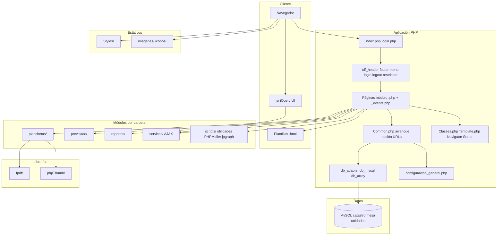
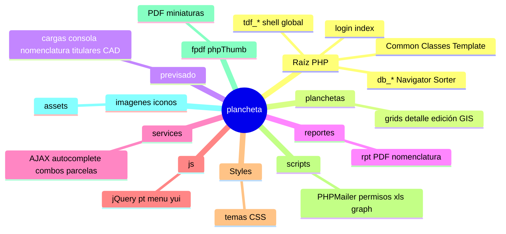
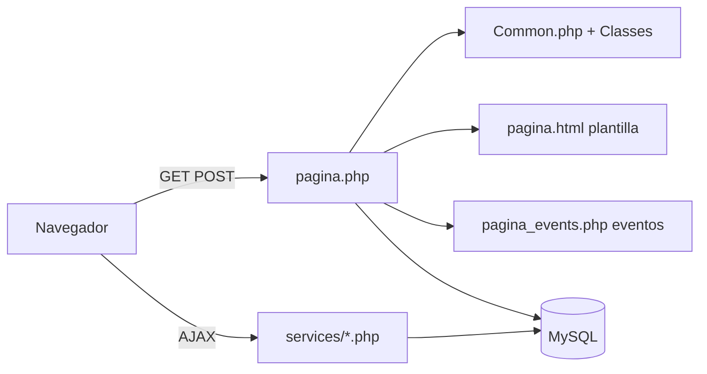
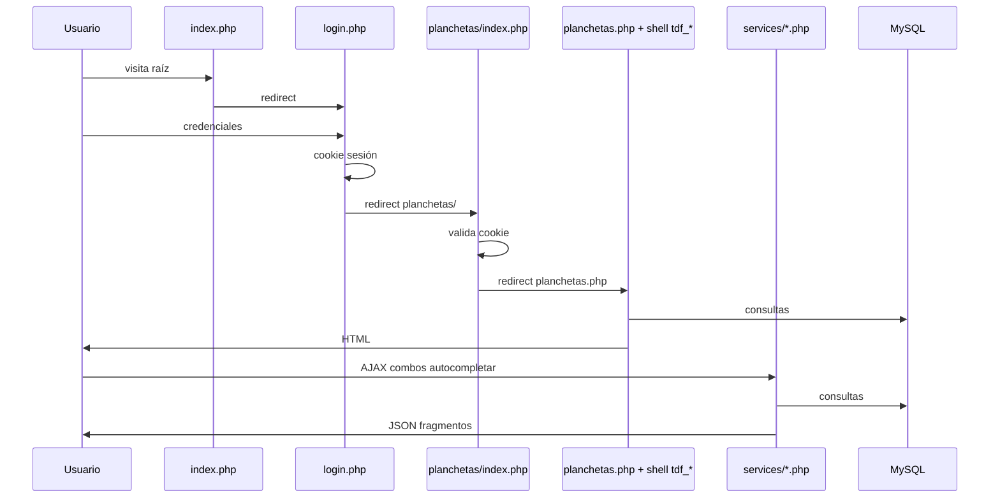

# Arquitectura del proyecto Plancheta

Aplicación web en **PHP** orientada al **Catastro de Tierra del Fuego** (“Plancheta online”). La base del código sigue el patrón típico de **CodeCharge Studio** (o un generador muy parecido): cada pantalla suele tener **tres archivos** que trabajan juntos.

## Patrón general de una página

| Archivo | Rol |
|--------|-----|
| `algo.php` | Lógica principal: conexión a datos, controles, flujo de la página. |
| `algo.html` | Plantilla HTML (marcadores/bloques que rellena el motor de plantillas). |
| `algo_events.php` | Manejadores de eventos (clics, envío de formularios, validaciones ligadas a la página). |

Los nombres con prefijos como **`PTAutocomplete`**, **`PTDependentListBox`**, **`PTAutoFill`** en `services/` corresponden a **servicios AJAX** que alimentan autocompletado, combos dependientes, etc.

## Núcleo compartido (raíz del proyecto)

- **`Common.php`**: arranque central: sesión, cabeceras HTTP, constantes (`ServerURL`, rutas), configuración de conexiones MySQL (`catastro`, `mesa`, `unidades`, `tdf_nuevo`), e inclusiones de `Classes.php` y `db_adapter.php`.
- **`Classes.php`**: framework embebido: controles de UI (`clsTextBox`, `clsMenu`, `clsField`, …), parámetros SQL, errores, etc.
- **`db_adapter.php`**, **`db_mysql.php`**, **`db_array.php`**: capa de acceso a datos (adaptador y driver MySQL; `db_array` suele usarse para pruebas o datos en memoria).
- **`Template.php`**: motor de plantillas (`clsTemplate`) que fusiona `.html` con datos.
- **`Navigator.php`**, **`Sorter.php`**, **`CalendarNavigator.php`**: paginación, ordenamiento y navegación de calendario en listados.
- **`Services.php`**: servicios auxiliares del framework.
- **`ClientI18N.php`**: internacionalización del lado cliente.
- **`myFunctions.php`** / **`myFunctions.js`**: funciones propias del proyecto.
- **`Functions.js`**, **`md5.js`**, **`DatePicker.js`**, **`DatePicker.html`**: JS compartido.
- **`preXls.php`** (+ `_events` y `.html`): flujo relacionado con salida hacia Excel.
- **`index.php`**: entrada que redirige a `login.php`.
- **`login.php`** + **`login.css`**: inicio de sesión.
- **`configuracion_general.php`**: constantes de negocio y despliegue (correo, rutas, URLs de planchetas/planos, ArcGIS, etc.). Tratar como información sensible en entornos reales.
- **`obtener_plano.php`**: proxy autenticado para servir PDFs de planos escaneados (`PLANOS_PATH` / carpetas por departamento) sin exponer la ruta real en el navegador. Exige sesión o cookie `registrado`; valida departamento y nombre de archivo antes de leer del disco.

### Descarga de planos y mitigación IDOR

El listado de parcelas en planchetas enlaza al PDF vía `obtener_plano.php?depto=…&plano=…` en lugar de una URL directa bajo `/tecnica/planos_nuevos/`.

**Operaciones / infraestructura:** mientras el servidor web siga sirviendo la carpeta `planos_nuevos` como archivos estáticos, un usuario podría seguir accediendo por URL directa si conoce o adivina la ruta. Para cerrar el IDOR por completo, conviene **denegar el acceso HTTP directo** a esa ruta (por ejemplo reglas en IIS, `.htaccess`, o mover los PDF fuera del document root y leerlos solo desde PHP).

- **`clean_test.php`**: página de prueba o limpieza.
- **`.htaccess`**: reglas Apache (si aplica).

## Capa visual común `tdf_`

Archivos **`tdf_*`**: layout y flujo global (cabecera, pie, menús, login/logout, zona restringida). Son la cáscara en la que se incrustan las pantallas de negocio.

## Directorios principales

- **`planchetas/`**: módulo Planchetas (listados, detalle, edición, observaciones, `gis_info`, etc.).
- **`services/`**: endpoints PHP para AJAX (parcelas, titulares, certificados, autocompletados, combos, etc.).
- **`Styles/`**: CSS por tema (`Simple`, `Simple1`, `Simple_tdf`, `Spring`, `jquery_ui`, …).
- **`js/`**: jQuery, jQuery UI, `menu`, `pt`, `yui`, etc.
- **`scripts/`**: PHPMailer, permisos, validaciones, jpgraph, salida XLS, etc.
- **`fpdf/`**: generación de PDF.
- **`phpThumb/`**: miniaturas de imágenes en servidor.
- **`imagenes/`**, **`iconos/`**: recursos estáticos.
- **`reportes/`**: informes y exportes relacionados.
- **`previsado/`**: flujo de previsados (cargas, consola, nomenclaturas, titulares, CAD, PDFs, etc.).
- **`.cursor/`**: metadatos del editor Cursor (no es parte de la app en servidor).

---

## Diagrama 1: Capas y dependencias

## Diagrama 2: Mapa mental de directorios

## Diagrama 3: Patrón de una pantalla

## Diagrama 4: Flujo de acceso típico (Planchetas)

## Cómo seguir leyendo el código

1. Identifica el **módulo** (`planchetas/`, `previsado/`, `reportes/`, o la raíz para `tdf_*`).
2. Abre el **`.php`** principal y el **`_events.php`** si existe.
3. Si hay AJAX o combos dinámicos, busca el nombre en **`services/`**.

Para ver los diagramas renderizados, usa una extensión Mermaid en el editor o la vista previa de Markdown en GitHub/GitLab.
